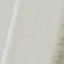
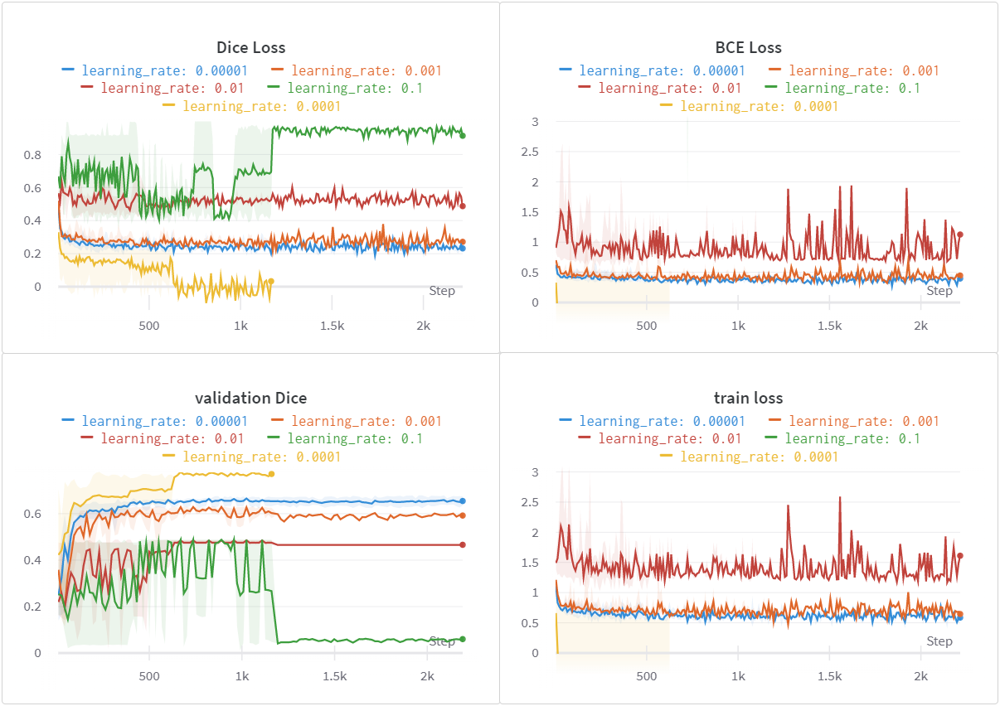
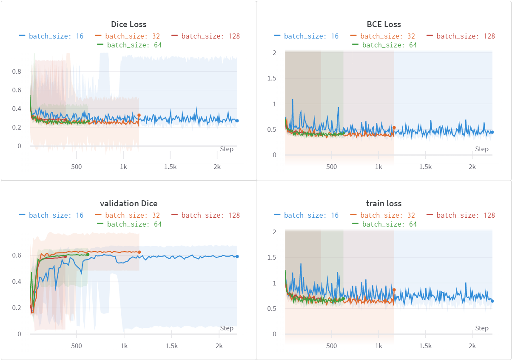
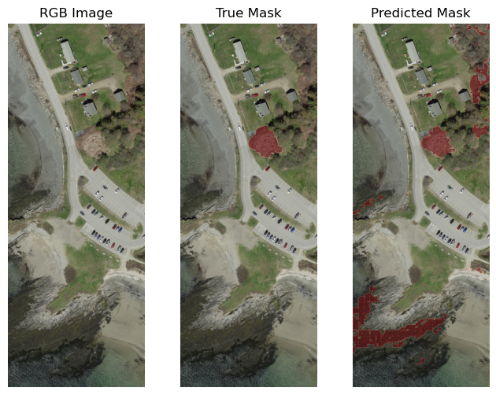
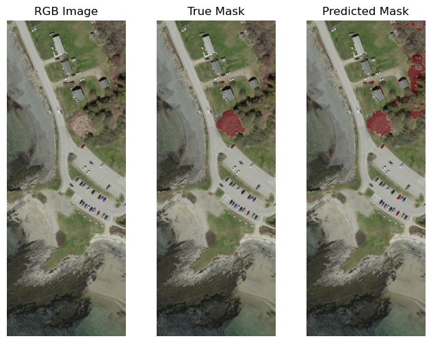
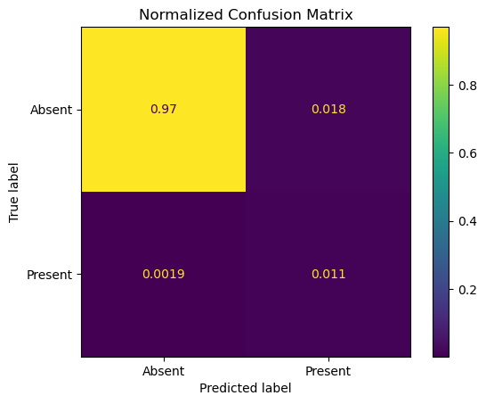

# Japanese Knotweed Detection with U-Net – Results

*2026-05-20T21:26:43Z by Showboat 0.6.1*
<!-- showboat-id: 1691bfe3-8849-4594-9ec2-6cfd3a5715bd -->

This document demonstrates the results of a U-Net CNN trained to detect *Fallopia japonica* (Japanese knotweed) in 7.5 cm/px ortho-rectified aerial imagery from the Maine GeoLibrary (2021). The model performs binary segmentation — classifying each pixel as invasive plant or background.

## Dataset

```python3

import json, pathlib

stats = json.loads(pathlib.Path('data/Image_Chips_128_overlap_balanced_dem/esri_accumulated_stats.json').read_text())
fs = stats['FeatureStats']

print(f'Image chip size:     {stats["TileSizeX"]}×{stats["TileSizeY"]} px  ({stats["NumBands"]} bands: R, G, B, NIR)')
print(f'Ground resolution:   {stats["MinCellSize"]["x"]*100:.1f} cm/px')
print(f'Training chips:      {stats["NumTiles"]}')
print(f'Target features:     {fs["NumFeaturesTotal"]} knotweed patches')
area = fs['FeatureAreaPerClass'][0]
print(f'Patch area range:    {area["Min"]:.3f} – {area["Max"]:.1f} m²  (mean {area["Mean"]:.1f} m²)')
print(f'Features per chip:   min {fs["NumFeaturesPerImage"]["Min"]}, mean {fs["NumFeaturesPerImage"]["Mean"]}, max {fs["NumFeaturesPerImage"]["Max"]}')

```

```output
Image chip size:     128×128 px  (4 bands: R, G, B, NIR)
Ground resolution:   7.5 cm/px
Training chips:      640
Target features:     720 knotweed patches
Patch area range:    0.000 – 92.2 m²  (mean 33.5 m²)
Features per chip:   min 1, mean 1.125, max 3
```

## Data Augmentation

Four augmentation strategies were evaluated to improve generalisation on the imbalanced dataset.

```bash {image}

```



## Hyperparameter Search

Learning rate and batch size were swept using Weights & Biases. The plots below show Dice loss, BCE loss, validation Dice score, and training loss across runs.

```bash {image}

```


```bash {image}

```


## Test Set Predictions

Two model checkpoints were evaluated on held-out test tiles. Each panel shows the RGB aerial image, the ground-truth mask (red = knotweed present), and the model's predicted mask.

```bash {image}

```


```bash {image}

```



## Confusion Matrix

```bash {image}

```



## Quantitative Results on Merged Test Set

The three prediction rasters (model checkpoints 93, 126, 127) are compared against the ground-truth polygon raster over the full merged test region.

```python3.12

from osgeo import gdal
import numpy as np

gdal.UseExceptions()

gt_src = gdal.Open('data/Test_Set_Merged/Invasives_PolygonToRaster.tif')
gt = (gt_src.GetRasterBand(1).ReadAsArray() > 127).astype(np.uint8).ravel()

total = len(gt)
pos = gt.sum()
print(f'Test region:    {1536}×{4096} px  ({total:,} pixels total)')
print(f'Ground truth:   {pos:,} positive pixels  ({pos/total*100:.2f}% prevalence)')
print()

header = f'{'Model':<20}  {'Precision':>10}  {'Recall':>10}  {'F1':>10}  {'IoU':>10}'
print(header)
print('-' * len(header))

for name in ['Test_93', 'Test_126', 'Test_127']:
    src = gdal.Open(f'data/Test_Set_Merged/{name}.tif')
    pred = src.GetRasterBand(1).ReadAsArray().ravel().astype(np.uint8)

    tp = int(((pred == 1) & (gt == 1)).sum())
    fp = int(((pred == 1) & (gt == 0)).sum())
    fn = int(((pred == 0) & (gt == 1)).sum())
    tn = int(((pred == 0) & (gt == 0)).sum())

    precision = tp / (tp + fp) if (tp + fp) else 0
    recall    = tp / (tp + fn) if (tp + fn) else 0
    f1        = 2*tp / (2*tp + fp + fn) if (2*tp + fp + fn) else 0
    iou       = tp / (tp + fp + fn) if (tp + fp + fn) else 0

    print(f'{name:<20}  {precision:>10.4f}  {recall:>10.4f}  {f1:>10.4f}  {iou:>10.4f}')

```

```output
Test region:    1536×4096 px  (6,291,456 pixels total)
Ground truth:   81,978 positive pixels  (1.30% prevalence)

Model                  Precision      Recall          F1         IoU
--------------------------------------------------------------------
Test_93                   0.1567      0.9349      0.2684      0.1550
Test_126                  0.1923      0.8894      0.3162      0.1878
Test_127                  0.3872      0.8568      0.5334      0.3637
```

Model 127 (revived-wind-127, epoch 20) achieves the best balance of precision and recall, with an F1 of 0.53 and IoU of 0.36. The lower-precision models (93, 126) capture more of the knotweed area but generate substantially more false positives, reflecting the severe class imbalance (~1.3% positive pixels).

## Interactive Web Map

The predictions and ground truth are available as an interactive map built with MapLibre GL JS and an OpenStreetMap basemap, replacing the original ArcGIS Online viewer.

```bash
ls -lh map/
```

```output
total 3.4M
-rw-r--r-- 1 root root 1.3M May 20 21:22 aerial.jpg
-rw-r--r-- 1 root root  35K May 20 21:22 ground_truth.geojson
-rw-r--r-- 1 root root 8.9K May 20 21:23 index.html
-rw-r--r-- 1 root root 513K May 20 21:22 prediction_126.geojson
-rw-r--r-- 1 root root 343K May 20 21:22 prediction_127.geojson
-rw-r--r-- 1 root root 1.2M May 20 21:22 prediction_93.geojson
```

Serve locally with: `python3 -m http.server 8000 --directory map/`

Enable GitHub Pages from the repository root to serve the map at https://philipmathieu.github.io/unet-orthoimagery/map/
